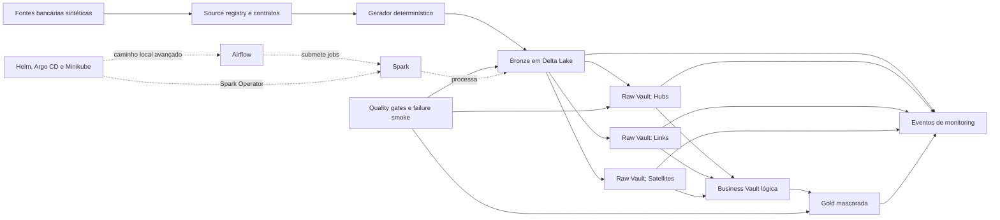

# Data Master Platform

Plataforma de dados bancários sintéticos para demonstrar, em ambiente local e
reproduzível, ingestão, armazenamento Delta Lake, modelagem Data Vault 2.0,
marts Gold protegidos, orquestração, observabilidade e GitOps.

[Validação completa do case](https://github.com/ale468/Data-Master-Platform/actions/workflows/case-validation.yml)
·
[Quality gates públicos](https://github.com/ale468/Data-Master-Platform/actions/workflows/ci.yml)
·
[Política de segurança](SECURITY.md)

## 1. Objetivo do Case

O case implementa um fluxo de Engenharia de Dados auditável para um domínio
bancário exclusivamente sintético. O objetivo é mostrar como contratos de
fonte, processamento Spark, armazenamento Delta, Data Vault, Gold, masking e
monitoramento podem ser integrados e verificados sem depender de edição manual
da máquina do avaliador.

Os critérios técnicos centrais são:

- reproduzir o caminho principal a partir de um clone limpo com um comando;
- rastrear cada estágio por status, duração, contagens e lote;
- interromper a validação quando dados, lineage, masking ou contratos divergem;
- medir dois volumes locais sem confundir a medição com escala produtiva;
- manter código, configuração, testes e automação publicamente verificáveis.

O baseline aprovado é local. Kubernetes, Spark Operator, Airflow e Argo CD
formam também um caminho local avançado, executado manualmente. `cloud-ready`
é somente um contrato de evolução; não representa cloud implantada ou
validada.

## 2. Arquitetura de Solução e Arquitetura Técnica



### Fluxo end-to-end

1. O gerador cria arquivos CSV e JSON sintéticos conforme o runtime profile.
2. A ingestão valida os contratos e grava sete tabelas Bronze com metadados
   técnicos e `batch_id`.
3. Jobs separados constroem Hubs, Links e Satellites na Raw Vault.
4. Helpers latest-state formam a Business Vault lógica.
5. Sete marts Gold são materializados a partir da Raw Vault, com
   pseudonimização e masking.
6. O gate Data Vault verifica Hubs, Links, Satellites, lineage, separação de
   paths e origem da Gold.
7. O gate de privacidade verifica colunas proibidas, padrões brutos, funções de
   masking e findings de secrets.
8. Eventos Delta de monitoring registram estágio, status, lote, duração e
   contagens.
9. O wrapper público projeta somente os campos allowlisted para um JSON de
   resultado e falha diante de qualquer divergência.

### Baseline local e arquitetura-alvo

| Superfície | Estado verificável | Limite |
|---|---|---|
| `local-small` | Spark local em contêiner; caminho Bronze → Raw Vault → Gold e gates | Prova funcional local, não escala distribuída |
| `local-medium` | Mesmo contrato com volume e recursos locais ampliados | Uma observação controlada, não benchmark estatístico |
| Airflow | DAG importável com oito tasks e imagem construída na CI | Não prova scheduler produtivo, HA ou multi-tenancy |
| Minikube/GitOps | Automação local avançada com Helm, Argo CD e Spark Operator | Execução manual; requer recursos e revisão publicada |
| `cloud-ready` | Configuração de referência com submission `reference-only` | Não é executada por este case |

Em ambos os profiles do benchmark, `local[*]` usa threads do scheduler local e
uma única JVM. Aumentar memória e partições demonstra comportamento vertical e
sensibilidade a volume; não comprova executores horizontais separados.

## 3. Explicação sobre o Case Desenvolvido

### Reprodução por um único comando

Pré-requisitos:

- Git;
- Windows PowerShell 5.1 ou PowerShell 7+;
- Docker com engine Linux;
- pelo menos 2 CPUs e 4 GiB disponíveis para o Docker;
- acesso à internet no primeiro build da imagem.

Em um clone limpo:

```powershell
git clone https://github.com/ale468/Data-Master-Platform.git
Set-Location Data-Master-Platform

powershell -ExecutionPolicy Bypass `
  -File .\scripts\Invoke-PublicCaseValidation.ps1 `
  -RuntimeProfile local-small
```

O comando:

- confirma Git, Docker, CPU, memória e arquivos obrigatórios;
- exige worktree limpo para associar o resultado ao SHA executado;
- constrói a imagem Spark sem login ou publicação;
- executa como usuário não privilegiado, com o repositório somente para leitura;
- valida pipeline, Data Vault, masking, observabilidade e secret scan;
- grava `build/public-case-validation/case-validation.json`, que é ignorado pelo
  Git;
- termina com `CASE_VALIDATION_STATUS=SUCCESS` somente quando todos os gates
  passam.

O JSON público não inclui workdir, paths Delta, amostras de masking, variáveis
de ambiente, credenciais ou erro bruto. Um payload ausente, inválido ou
divergente produz exit code diferente de zero.

### Evidência no GitHub Actions

O workflow
[`case-validation.yml`](.github/workflows/case-validation.yml) executa o mesmo
wrapper em pull requests e por `workflow_dispatch`. Ele publica:

- artifact JSON sanitizado por 14 dias;
- resumo com Pipeline, Data Vault, Masking, Observability, Secret scan e
  resultado geral;
- status de job coerente com o resultado do gate.

O workflow
[`ci.yml`](.github/workflows/ci.yml) separa validações estáticas, Helm, Spark e
Airflow. Ele compila Python, executa testes runtime e Data Vault, valida
streaming/CDC/conector, lineage, masking, falha observável, DAG, YAML, JSON,
PowerShell, links, paths, secrets e os seis charts permitidos. As imagens
Airflow e Spark são construídas, mas nunca publicadas.

Os workflows usam apenas `contents: read`; não fazem login em registry, push
de imagem ou deploy.

### Observabilidade e detecção controlada de falhas

O contrato
[`thresholds.yml`](config/observability/thresholds.yml) define:

| Sinal | Threshold demonstrativo |
|---|---:|
| Eventos de monitoring do fluxo completo | mínimo `5` |
| Geração de amostra | máximo `30 s` |
| Cada estágio Bronze, Raw Vault ou Gold | máximo `180 s` |
| Volume por fonte ou camada | mínimo `1` registro |
| Queda do mesmo volume de referência | máximo `50%` |
| Falhas de qualidade | máximo `0` |
| Falhas de masking | máximo `0` |

O
[`run_observability_failure_smoke.py`](jobs/observability/run_observability_failure_smoke.py)
injeta somente dados sintéticos e temporários. Os cenários exercitados são:

| Cenário | Regra primária | Stage | Contrato de processo |
|---|---|---|---|
| Schema inválido | `source.schema.required_columns` | `bronze` | exit `1` quando detectado corretamente |
| Fonte ausente | `source.file.required` | `bronze` | exit `1` quando detectado corretamente |
| Volume zero | `volume.minimum_rows` | `bronze` | exit `1` quando o gate bloqueia o stage |

Exit `2` representa erro do harness, regra incorreta, ausência de detecção ou
um stage operacional indevidamente bem-sucedido. Portanto, a falha proposital
não é convertida em sucesso.

### Benchmark de escalabilidade local controlada

O
[`run_scalability_benchmark.py`](jobs/scalability/run_scalability_benchmark.py)
executa cada profile em processo e workdir separados. O orquestrador impõe
timeout, recompõe os gates do worker, rejeita payload inseguro e não usa speedup
como critério funcional.

Medição observada em 25 de julho de 2026, em uma execução por profile:

| Profile | Registros de fonte | Spark configurado | Pipeline | Total | Throughput do pipeline | Bronze / Hubs / Links / Satellites / Gold | Stage mais lento | Gates |
|---|---:|---|---:|---:|---:|---|---|---|
| `local-small` | 399 | `local[*]`, `768m`, 2 partições | 444,671 s | 596,088 s | 0,897 reg/s | 399 / 204 / 343 / 419 / 295 | Bronze | Data Vault `PASS`; masking `PASS`; monitoring `5` |
| `local-medium` | 17.028 | `local[*]`, `2g`, 8 partições | 395,813 s | 544,579 s | 43,020 reg/s | 17.028 / 7.033 / 11.892 / 17.528 / 5.722 | Bronze | Data Vault `PASS`; masking `PASS`; monitoring `5` |

Comparação descritiva: o volume observado aumentou
`42,677` vezes e a duração end-to-end foi `0,914` vez a observada no profile
menor. O resultado não exige melhora linear.
Startup, cache local, commits Delta e releituras dos gates influenciam a
medição; os números não são SLA, sizing produtivo ou previsão de cloud.

### Matriz requisito → implementação → evidência

| Requisito | Implementação pública | Evidência verificável |
|---|---|---|
| Reprodutibilidade | [`Invoke-PublicCaseValidation.ps1`](scripts/Invoke-PublicCaseValidation.ps1) | JSON ignorado localmente e artifact do [workflow](https://github.com/ale468/Data-Master-Platform/actions/workflows/case-validation.yml) |
| Observabilidade | [`monitoring.py`](jobs/common/monitoring.py), thresholds e failure smoke | Cinco eventos no end-to-end; três falhas negativas; testes em [`test_observability_detection.py`](tests/runtime/test_observability_detection.py) |
| Escalabilidade | Runtime profiles e benchmark isolado | JSON comparativo e contratos em [`test_scalability_profiles.py`](tests/runtime/test_scalability_profiles.py) |
| Data Vault e lineage | Hubs, Links, Satellites e quality gate executável | Suíte [`tests/data_vault`](tests/data_vault) e job Spark da CI |
| Gold e privacidade | Marts Raw-derived, pseudonimização, masking e scan | [`run_gold_masking_smoke.py`](jobs/business_vault/run_gold_masking_smoke.py) e gate Spark |
| Streaming e CDC | Structured Streaming com file source e semântica CDC local | Smokes versionados e executados na CI; sem claim de broker ou log capture |
| Orquestração | DAG Airflow com oito tasks que submetem jobs Spark | Import da DAG em imagem Airflow na CI |
| GitOps local | Scripts Minikube, charts Helm e app-of-apps Argo CD | `helm lint/template` na CI e [guia operacional](infra/README-gitops.md) |
| Qualidade pública | Workflows separados por tipo de gate | Gates fail-closed, permissões somente leitura e builds sem push; branch protection não foi verificada |

### Estrutura principal

```text
config/                     Profiles, privacidade e thresholds públicos
dags/                       DAG Airflow
data/sample/                Amostras exclusivamente sintéticas
infra/                      Helm, Argo CD, workloads e referências Terraform
jobs/                       Geração, ingestão, Data Vault, Gold e smokes
scripts/                    Validação pública e automação Minikube
tests/                      Contratos runtime, Data Vault e PowerShell
```

## 4. Melhorias e Considerações Finais

Esta versão acrescenta uma validação pública de um comando, CI expandida,
detecção negativa de falhas, benchmark controlado, scanner fail-closed e um
guia GitOps alinhado aos manifests atuais. A defesa técnica pode partir do
README, abrir o workflow e, se necessário, reproduzir o artifact a partir do
mesmo SHA.

### Limites que permanecem válidos

| Tema | O que foi demonstrado | O que não deve ser afirmado |
|---|---|---|
| Cloud | Arquitetura e profile de referência | Deploy cloud validado, operação ou custo |
| Escala | Dois volumes locais, memória/partições e gargalo por wall-clock | Autoscaling, escala horizontal ou speedup linear |
| Streaming | Microbatch local com file source e checkpoint | Kafka, Kinesis, Event Hubs ou SLA produtivo |
| CDC/conectores | Semântica CDC e contrato de adapter local | Debezium, Airbyte, Kafka Connect ou log capture real |
| LGPD | Classificação, pseudonimização, masking e scan técnico | Certificação, parecer jurídico ou compliance formal |
| Observabilidade | Eventos, contagens, duração, thresholds e falha atribuída | Dashboard, alertas, SLO, paging ou operação on-call |
| Orquestração | DAG, imagens e caminho Minikube avançado | Airflow/Kubernetes produtivo, HA ou multi-tenancy |
| Secrets | Ausência de segredo versionado e Secrets locais gerados | Secret manager corporativo, IAM ou rotação produtiva |

Evoluções futuras exigem ambiente, gate e evidência próprios. Adicionar uma
tecnologia ao desenho não a transforma em capacidade implementada.

Use somente dados sintéticos. Não versione tokens, chaves, senhas ou arquivos
`.env`. Gold deve continuar mascarada.

Para contribuir, leia [CONTRIBUTING.md](CONTRIBUTING.md),
[GOVERNANCE.md](GOVERNANCE.md) e
[CODE_OF_CONDUCT.md](CODE_OF_CONDUCT.md). O código é licenciado sob
[`AGPL-3.0-only`](LICENSE); dependências, imagens base, marcas e materiais de
terceiros permanecem sob seus próprios termos.
