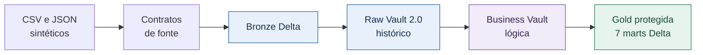
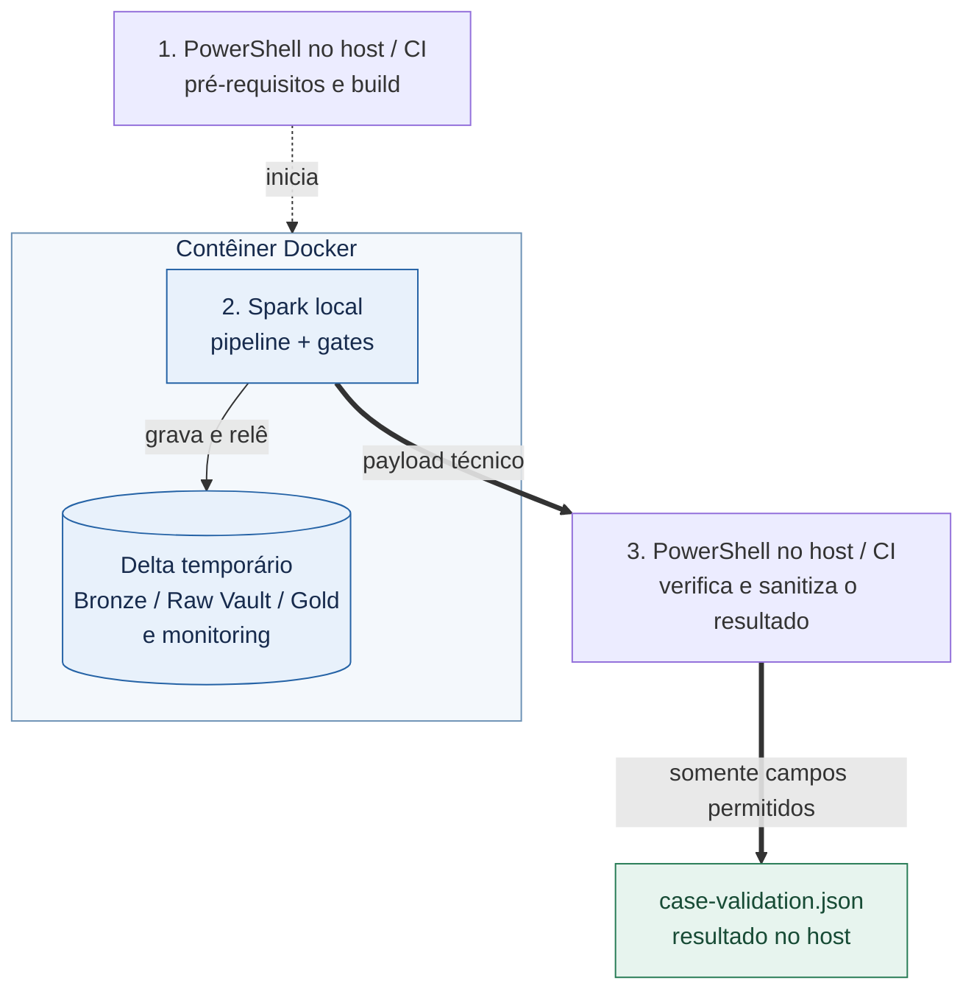
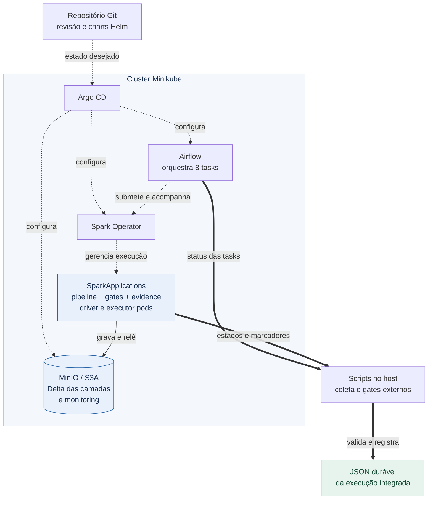
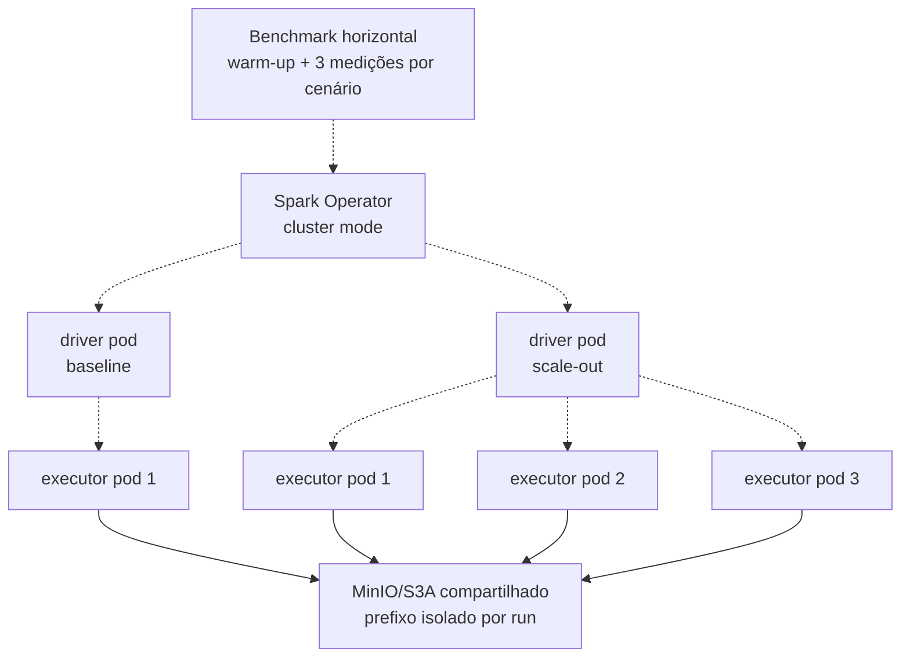

# Data Master Platform

**De dados bancários sintéticos a análises rastreáveis e protegidas.**

Este case integra fontes CSV e JSON, preserva seu histórico em um lakehouse e
entrega tabelas analíticas com mascaramento. A banca pode acompanhar o dado
da origem ao consumo, inspecionar as regras e reproduzir a validação local.

- **Sete marts Gold:** saídas analíticas derivadas da Raw Vault, com regras de
  proteção verificáveis no [código da Gold](jobs/business_vault/load_gold.py).
- **Validação por um comando:** após os pré-requisitos e o clone, o
  [caminho principal](#reproduzir) executa o fluxo e os gates em Docker e
  produz um JSON sanitizado.
- **Scale-out medido:** de um para três executores Spark, com speedup de
  **1,43x** em um único nó, no experimento de **28/07/2026**. Veja
  [método, evidência e limites](#escala-horizontal).

> Escopo: demonstração local com dados exclusivamente sintéticos. Resultados
> registrados pertencem às execuções e revisões identificadas; não representam
> produção, cloud validada ou uma nova execução na máquina do leitor.

**Roteiro de leitura:** [objetivo e requisitos](#1-objetivo-do-case) →
[arquitetura](#2-arquitetura-de-solução-e-arquitetura-técnica) →
[exemplo e reprodução](#3-explicação-sobre-o-case-desenvolvido) →
[melhorias e conclusão](#4-melhorias-e-considerações-finais).

[Workflow de validação automatizada](https://github.com/ale468/Data-Master-Platform/actions/workflows/case-validation.yml)
·
[Quality gates do case](https://github.com/ale468/Data-Master-Platform/actions/workflows/ci.yml)
·
[Política de segurança](SECURITY.md)

## 1. Objetivo do Case

### Problema, domínio e resultado

Como integrar cadastros e movimentações bancárias sem perder a origem dos
registros, o histórico das mudanças e o controle sobre identificadores?

O domínio simulado reúne clientes, contas, cartões, agências, produtos,
transações e eventos digitais. Contratos validam as entradas; a Raw Vault
preserva chaves, relacionamentos e atributos históricos; a Gold organiza o
consumo analítico. Assim, é possível analisar transações por dia ou por
cliente pseudonimizado e atividade digital por canal sem usar dados reais.

O resultado esperado é um fluxo verificável, da fonte à Gold, com contagens,
lote, duração, rastreabilidade da origem dos dados (lineage) e verificações
obrigatórias de qualidade (gates). Na validação pública, uma divergência
impede o resultado geral de sucesso.

<a id="requisitos-do-pdf"></a>

### Mapeamento dos oito requisitos do PDF ao repositório

A matriz relaciona implementação, teste e medição. Um link para código mostra
o mecanismo; uma evidência de execução registra somente seu escopo, data e
revisão. Os controles de segurança implementados e seus limites observáveis
estão explicitados abaixo para avaliação da banca.

| Requisito | Implementação e mecanismo | Onde conferir | Escopo e limite |
|---|---|---|---|
| **1. Extração de Dados** | Geração controlada de fontes sintéticas em CSV e JSON, com contratos de fonte. | [Gerador](jobs/data_generation/) e [source registry](jobs/common/source_registry.py). | Dados simulados, admitidos pelo enunciado; não há extração de sistemas bancários reais. |
| **2. Ingestão de Dados** | Batch no fluxo principal; streaming por arquivos e CDC por changelog em demonstrações específicas. | [Jobs Bronze](jobs/bronze/) e [gates Spark da CI](.github/workflows/ci.yml). | Streaming e CDC locais não equivalem a broker produtivo nem captura de transaction log. |
| **3. Armazenamento de Dados** | Tabelas Delta; filesystem temporário no Docker e MinIO/S3A no caminho integrado. | [Delta I/O](jobs/common/delta_io.py) e [decisões de arquitetura](#decisoes). | Alternativas locais e cloud são comparadas; cloud não foi implantada. |
| **4. Observabilidade** | Eventos Delta com lote, status, duração e contagens; detecção de falhas controladas. | [Monitoring](jobs/common/monitoring.py), [thresholds](config/observability/thresholds.yml) e [testes de detecção](tests/runtime/test_observability_detection.py). | Não há dashboard, alertas ou operação on-call; veja quais verificações pertencem a cada execução. |
| **5. Segurança de Dados** | Execução Docker não privilegiada, montagem somente leitura, Secrets locais e scanner de segredos. | [Validador público](scripts/Invoke-PublicCaseValidation.ps1), [RBAC](infra/helm-charts/airflow/templates/rbac.yaml) e [limites de segurança](#seguranca). | Não há evidência de criptografia ponta a ponta, autorização de acesso aos dados ou conformidade integral com a LGPD. |
| **6. Mascaramento de Dados** | Mascaramento e pseudonimização na Gold, com validação de colunas e padrões proibidos. | [Exemplo concreto](#exemplo-cliente) e [gate de privacidade](jobs/business_vault/run_gold_masking_smoke.py). | Redução da exposição não é garantia de anonimização irreversível. |
| **7. Arquitetura de Dados** | Bronze → Raw Vault → Business Vault lógica → Gold; Spark separado da orquestração no Minikube. | [Diagramas](#arquitetura-solucao), [DAG](dags/banking_data_vault_pipeline_dag.py) e [testes Data Vault](tests/data_vault/). | Business Vault não materializada; sem PIT/Bridge ou arquitetura produtiva validada. |
| **8. Escalabilidade** | Comparação de dois perfis locais e experimento Spark com um e três executores. | [Evidência horizontal versionada](tests/evidence/horizontal-scaling/hscale-20260728064640.json) e [interpretação dos resultados](#escala-horizontal). | Scale-out estático em um nó; multi-node, autoscaling e demanda contínua em tempo real são evolução. |

A reprodutibilidade, também exigida pelo enunciado, tem
[pré-requisitos, comando e critérios de sucesso](#reproduzir) neste README.
Os detalhes operacionais expansíveis complementam a leitura sem substituir
as explicações essenciais.

## 2. Arquitetura de Solução e Arquitetura Técnica

<a id="arquitetura-solucao"></a>

### Arquitetura da solução: o percurso do dado

Este desenho mostra responsabilidades lógicas, não a localização dos processos.
A mesma sequência de camadas é usada pelos caminhos Docker e Minikube.



| Camada | Por que existe | O que é persistido |
|---|---|---|
| Bronze | Receber fontes validadas com origem, lote e metadados técnicos. | Sete tabelas Delta de entrada. |
| Raw Vault 2.0 | Separar chaves de negócio (Hubs), relacionamentos (Links) e atributos históricos (Satellites). | Tabelas Delta com histórico e lineage. |
| Business Vault lógica | Reunir o estado mais recente da Raw Vault e aplicar regras para consumo. | DataFrames intermediários; não existe uma Business Vault física nem PIT/Bridge. |
| Gold | Expor agregações e cadastros protegidos para análise. | Sete marts Delta sob `/gold`, sem confusão com o path reservado `/business_vault`. |

As setas contínuas representam o fluxo de dados. Os gates consultam as
camadas para validar qualidade e proteção; não são uma camada adicional do
lakehouse.

<a id="runtime-docker"></a>

### Arquitetura técnica A: validação principal em Docker

Este é o caminho de entrada para a banca. **Não inicia Airflow, Minikube,
Argo CD nem MinIO.** O Spark usa filesystem local dentro do contêiner.



Fora da caixa Docker, os passos 1 e 3 executam no host ou runner da CI e
pertencem ao mesmo script. O
[validador público](scripts/Invoke-PublicCaseValidation.ps1) monta o
repositório somente para leitura e executa
[run_presentation_demo.py](jobs/demo/run_presentation_demo.py) sem privilégios
de root. O script no host confere o resultado e seleciona campos permitidos
(allowlist) antes de gravar o JSON. O conteúdo temporário do contêiner não
é o artefato público.

<a id="runtime-minikube"></a>

### Arquitetura técnica B: execução integrada em Minikube

Este é um caminho manual separado, com orquestração e armazenamento
compartilhado. A caixa abaixo delimita o que executa dentro do cluster.



**Legenda dos diagramas técnicos:** seta contínua = dados; tracejada =
configuração ou orquestração; espessa = resultados e coleta de evidências.

A [DAG oficial](dags/banking_data_vault_pipeline_dag.py) executa, em sequência,
`bronze → hubs → links → satellites → gold → data-vault-gate → masking-gate → evidence`.
Cada task submete uma SparkApplication. Portanto, **os gates Data Vault e
masking da DAG executam dentro do cluster**, assim como o estágio `evidence`.
Airflow orquestra; não executa o processamento Spark dentro de seu próprio
processo. O app GitOps de Spark configura RBAC; as SparkApplications são
criadas dinamicamente, não instaladas como jobs permanentes pelo Argo CD.

O monitoring é gravado pelos jobs como Delta no MinIO. Separadamente, os
[scripts de coleta](scripts/minikube/DataMaster.ExecutionEvidence.ps1)
consolidam estados e marcadores, e os
[gates externos](scripts/minikube/Invoke-DataMasterQualityGates.ps1) conferem a
execução integrada. A figura foca a DAG; Jupyter e os serviços PostgreSQL/Hive
de apoio estão descritos no [guia GitOps](infra/README-gitops.md).

### Três resultados distintos, sem misturar seus escopos

| Resultado | Quem o produz | Onde fica e o que comprova |
|---|---|---|
| Validação pública Docker | Validador PowerShell, a partir do processo Spark local. | `build/public-case-validation/case-validation.json`; resultado local sanitizado, ignorado pelo Git. |
| Execução integrada | Coleta PowerShell de Airflow e SparkApplications. | `evidence/runtime/<run-id>.json`, criado pela execução; não é o JSON do caminho Docker. |
| Experimento horizontal | Orquestrador e agregador específicos do benchmark. | [Artefato versionado](tests/evidence/horizontal-scaling/hscale-20260728064640.json); compara executores e equivalência funcional, sem provar uma execução da DAG Airflow. |

Ter código, DAG importável ou chart renderizado não demonstra que um cluster
está ativo. O estado de cada execução deve ser conferido pelos seus próprios
marcadores e artefatos.

<a id="decisoes"></a>

### Escolhas técnicas e alternativas

| Escolha | Por que atende ao case | Alternativa e compromisso |
|---|---|---|
| **Delta Lake** | Acrescenta transações ACID, controle de schema e histórico ao armazenamento em arquivos. A Bronze recebe CSV/JSON antes da organização analítica. | Parquet simples reduz componentes, mas exige outros mecanismos para transações e histórico. O volume medido é local, não uma prova de capacidade ilimitada. |
| **Filesystem local / MinIO** | O filesystem simplifica a primeira reprodução; MinIO permite que pods separados acessem o mesmo armazenamento por S3A. | Object storage gerenciado facilita a evolução cloud, mas exige provedor, credenciais, políticas de acesso e avaliação de custo e desempenho. Não foi implantado aqui. |
| **Raw Vault + Gold** | Mantém histórico e origem separados das regras de consumo, úteis para integrar fontes heterogêneas. | Um modelo dimensional direto seria mais simples para um conjunto pequeno e estável de análises. Data Vault acrescenta tabelas, joins e esforço de operação. |
| **Spark** | Usa o mesmo conjunto de transformações nos perfis locais e permite processamento com executores separados no experimento Kubernetes. | Um banco analítico ou warehouse gerenciado pode simplificar SQL e consumo, mas muda o modelo de operação, custo e dependência de provedor. |
| **Airflow + Spark Operator + Argo CD** | Separa orquestração, execução de jobs e configuração declarativa no caminho integrado. | O comando Docker é suficiente para verificar a lógica local; Kubernetes acrescenta recursos, RBAC e diagnóstico de múltiplos componentes. |

O desenho permite discutir volume, velocidade e variedade sem supor que uma
tecnologia resolve os três aspectos automaticamente. O caso principal é
batch; menor latência contínua, elasticidade e segurança produtiva exigem
novas implementações e medições.

## 3. Explicação sobre o Case Desenvolvido

<a id="exemplo-cliente"></a>

### Um cliente, da origem à Gold

Considere um cadastro **sintético** de João da Silva. Este exemplo explica a
transformação implementada; não é uma amostra extraída de uma nova execução.

1. **Origem e Bronze:** o arquivo de clientes é validado pelo contrato de
   fonte. A Bronze mantém o cadastro com os metadados de origem e lote.
2. **Raw Vault:** `hub_cliente` identifica a chave de negócio. Os Satellites
   `sat_cliente_dados_cadastrais` e `sat_cliente_documentos` preservam os
   atributos e seu histórico, em vez de misturá-los à regra analítica.
3. **Business Vault lógica:** o helper reúne o Hub ao estado mais recente dos
   Satellites. Essa visão intermediária é calculada sobre a Raw Vault.
4. **Gold:** `gold_clientes_protegidos` grava o cadastro com pseudônimo e
   atributos mascarados. Já `gold_transacoes_por_cliente` permite analisar
   quantidade, total e média das transações por cliente pseudonimizado.
5. **Verificação:** gates conferem histórico, relações, lineage e saídas
   protegidas; o monitoring permite associar o processamento ao mesmo lote.

As saídas abaixo seguem as expressões efetivamente usadas por
[load_gold.py](jobs/business_vault/load_gold.py), não apenas exemplos dos
helpers genéricos de mascaramento:

| Campo sintético de entrada | Valor ilustrativo | Saída em `gold_clientes_protegidos` |
|---|---|---|
| `nome` | `João da Silva` | `nome_cliente = J***` |
| `cpf` | `123.456.789-10` | `cpf_mascarado = *********10` |
| `email` | `joao.silva@example.com` | `email_mascarado = j***@example.com` |
| `telefone` | `+55 (11) 98765-4321` | `telefone_mascarado = *** (*) ****-4321` |

O identificador do cliente é substituído por `CLI_` seguido dos primeiros
oito caracteres hexadecimais, em maiúsculas, do SHA-256 do identificador
original. É uma pseudonimização determinística demonstrativa, não criptografia
nem garantia de anonimização irreversível.

<details>
<summary>As sete saídas Gold e suas finalidades</summary>

| Mart | Finalidade analítica |
|---|---|
| `gold_transacoes_por_dia` | Agregações de movimentação diária. |
| `gold_transacoes_por_cliente` | Agregações por cliente pseudonimizado. |
| `gold_clientes_protegidos` | Cadastro com identificadores protegidos. |
| `gold_volume_por_produto` | Visão de movimentação por produto. |
| `gold_eventos_digitais_por_canal` | Atividade digital por canal. |
| `gold_contas_por_agencia` | Agregações de contas por agência. |
| `gold_risco_transacional_simplificado` | Indicador ilustrativo baseado em regras; não é decisão de crédito nem modelo de risco validado. |

Os builders e as regras estão no [código da Gold](jobs/business_vault/load_gold.py).

</details>

<a id="seguranca"></a>

### Segurança e privacidade: controles distintos

A proteção de consumo está na Gold. Bronze e Raw Vault preservam valores
brutos **sintéticos** para ingestão e histórico; a classificação de um
Satellite como restrito não constitui, por si só, uma autorização de acesso
implementada.

| Controle | Implementação demonstrativa | Limite explícito |
|---|---|---|
| Mascaramento | Oculta partes dos atributos ou substitui seu conteúdo na Gold. | Não cifra dados; campos como cidade e estado permanecem disponíveis. |
| Pseudonimização | Substitui identificadores por uma representação determinística derivada de hash. | O hash truncado sem segredo não garante irreversibilidade, ausência de colisões ou resistência à reidentificação. |
| Execução e acesso técnico | Docker sem root e montagem somente leitura; RBAC e referências a Kubernetes Secrets no caminho integrado. | Isolamento de processo e permissão para orquestrar jobs não equivalem a autorização por usuário sobre os dados. |
| Credenciais | Geração local de Secrets e scan de padrões de segredos no repositório e nos resultados. | Não comprova secret manager, rotação ou IAM corporativo; o scanner não detecta todo segredo possível. |
| Criptografia | Não demonstrada de ponta a ponta. A [configuração S3A da DAG](dags/spark_application_factory.py) usa endpoint HTTP e SSL desabilitado. | TLS no tráfego de dados, criptografia em repouso e gestão de chaves são melhorias necessárias antes de dados reais. |
| LGPD | Classificação, minimização da exposição e gates técnicos de privacidade. | Não constitui parecer jurídico, certificação ou atendimento integral às obrigações da LGPD. |

O repositório apresenta execução Docker não privilegiada, montagem somente
leitura, RBAC, referências a Secrets, scanner de segredos, masking e
pseudonimização. Não há evidência de criptografia ponta a ponta, autorização
por usuário sobre os dados, gestão corporativa de segredos ou conformidade
integral com a LGPD. As [melhorias priorizadas](#evolucao) tratam os controles
ainda necessários.

<a id="reproduzir"></a>

### Reprodução por um único comando

Procedimento de referência em Windows. Pré-requisitos:

- Git;
- Windows PowerShell 5.1 ou PowerShell 7+;
- Docker com engine Linux;
- pelo menos 2 CPUs e 4 GiB disponíveis para o Docker;
- acesso à internet no primeiro build da imagem.

Após instalar os pré-requisitos, obtenha um clone limpo e execute a validação:

```powershell
git clone https://github.com/ale468/Data-Master-Platform.git
Set-Location Data-Master-Platform

powershell -ExecutionPolicy Bypass `
  -File .\scripts\Invoke-PublicCaseValidation.ps1 `
  -RuntimeProfile local-small
```

O comando:

- confirma Git, Docker, CPU, memória e arquivos obrigatórios;
- exige worktree limpo para associar o resultado ao SHA executado;
- constrói a imagem Spark sem login ou publicação;
- executa como usuário não privilegiado, com o repositório somente para leitura;
- valida pipeline, Data Vault, masking, observabilidade e secret scan;
- grava `build/public-case-validation/case-validation.json`, que é ignorado pelo
  Git;
- termina com `CASE_VALIDATION_STATUS=SUCCESS` somente quando todos os gates
  passam.

O JSON sanitizado não inclui workdir, paths Delta, amostras de masking, variáveis
de ambiente, credenciais ou erro bruto. Um payload ausente, inválido ou
divergente produz exit code diferente de zero.

O comando retorna sucesso somente com exit code `0`, marcador
`CASE_VALIDATION_STATUS=SUCCESS` e JSON gravado com status geral e checks
aprovados. Um contêiner iniciado ou uma tabela criada, isoladamente, não
representam o resultado integral do comando.

O contêiner é removido por `--rm`; os dados Delta temporários não ficam
disponíveis no host. O JSON permanece no diretório ignorado pelo Git e a
imagem fica em cache. Uma repetição gera um novo lote e substitui o resultado
no caminho padrão; preserve o JSON anterior fora do Git se precisar compará-lo.
Não há retomada intermediária desse fluxo: corrija a causa e execute novamente.

<details>
<summary>Diagnóstico rápido da validação principal</summary>

| Sintoma | Conferência | Ação segura |
|---|---|---|
| Docker indisponível | `docker version` e `docker info`. | Inicie a engine Linux e repita a verificação. |
| CPU ou memória insuficientes | Recursos disponíveis ao Docker, não apenas o total do host. | Disponibilize ao menos 2 CPUs e 4 GiB; não reduza os gates para forçar sucesso. |
| Árvore Git suja | `git status --short`. | Preserve suas mudanças e use um clone limpo para evidência vinculada ao commit. |
| Validação retorna falha | Exit code, marcador final e `failed_checks` do JSON, quando disponível. | Corrija a causa indicada; ausência de resultado ou falha de gravação não é aprovação. |

O primeiro build depende de rede e cache. O case não estabelece duração
garantida para execução em outra máquina.

</details>

### Evidência no GitHub Actions

O workflow
[`case-validation.yml`](.github/workflows/case-validation.yml) executa o mesmo
orquestrador em pull requests e por `workflow_dispatch`. Ele publica:

- artefato JSON sanitizado por 14 dias;
- resumo com Pipeline, Data Vault, Masking, Observability, Secret scan e
  resultado geral;
- status de job coerente com o resultado do gate.

O workflow
[`ci.yml`](.github/workflows/ci.yml) separa validações estáticas, Helm, Spark e
Airflow. Ele compila Python, executa testes runtime e Data Vault, valida
streaming/CDC/conector, lineage, masking, falha observável, DAG, YAML, JSON,
PowerShell, links, paths, secrets e os seis charts permitidos. As imagens
Airflow e Spark são construídas, mas nunca publicadas.

Os workflows usam apenas `contents: read`; não fazem login em registry, push
de imagem ou deploy.

Esses links mostram a automação, não garantem o estado atual da CI. Ao
inspecionar uma execução, confira seu SHA, data, checks e resultado. O
artefato do Actions pode expirar; o
[experimento horizontal versionado](tests/evidence/horizontal-scaling/hscale-20260728064640.json)
permanece no Git, e o comando principal permite gerar um novo resultado local.

### Reprodução integrada: quando usar o Minikube

Use este caminho para demonstrar os componentes da
[arquitetura técnica B](#runtime-minikube), não como pré-requisito do comando
Docker. Ele faz build e provisionamento local e inclui um restart controlado
do MinIO.

Pré-requisitos adicionais: Minikube, `kubectl` e Helm 3; ao menos 4 CPUs e
11 GiB disponíveis para Docker no perfil padrão; margem de memória e disco
para o host, as imagens e o disco Minikube de 30 GiB. O procedimento exige
árvore Git limpa, revisão publicada igual ao `HEAD` local e um profile alvo
novo e ausente. O script não publica revisões nem reutiliza profiles.

<details>
<summary>Comando integrado, sinais de sucesso, acesso e encerramento</summary>

Na raiz de um clone limpo da revisão publicada:

```powershell
$demoRevision = (git rev-parse HEAD).Trim()
$demoProfile = "data-master-banca-" + (Get-Date).ToUniversalTime().ToString("yyyyMMddHHmmss")

.\scripts\minikube\Invoke-DataMasterCleanRoomValidation.ps1 `
  -RepoUrl "https://github.com/ale468/Data-Master-Platform.git" `
  -Revision $demoRevision `
  -Profile $demoProfile `
  -Cpus 4 `
  -Memory 11264 `
  -DiskSize 30g `
  -Driver docker
```

O fluxo cria o cluster isolado, constrói e importa imagens imutáveis,
configura Secrets e GitOps, espera prontidão, executa a integração e a DAG,
coleta evidências e avalia os gates externos. A conclusão exige estes quatro
marcadores em conjunto, além do JSON indicado por
`CLEAN_ROOM_DURABLE_EVIDENCE_PATH`:

```text
CLEAN_ROOM_ISOLATION_STATUS=PASS
CLEAN_ROOM_RESTART_STATUS=PASS
CLEAN_ROOM_GITOPS_STATUS=PASS
CLEAN_ROOM_REPRODUCIBILITY_STATUS=PASS
```

O cluster permanece disponível; o clean-room encerra seus próprios
port-forwards. Para abrir as interfaces após a conclusão:

```powershell
.\scripts\minikube\Start-DataMasterPortForwards.ps1 -Profile $demoProfile
```

| Interface | Endereço local |
|---|---|
| Argo CD | `https://localhost:8080` |
| Airflow | `http://localhost:8082` |
| MinIO API / Console | `http://localhost:9000` / `http://localhost:9001` |
| Jupyter | `http://localhost:8888` |

As credenciais são geradas em Kubernetes Secrets; não use senhas fixas nem
copie valores para logs ou evidências. O [guia GitOps](infra/README-gitops.md)
detalha as referências de Secrets e a inspeção dos componentes.

Parar os acessos não remove o cluster:

```powershell
.\scripts\minikube\Stop-DataMasterPortForwards.ps1 -Profile $demoProfile
```

Para remover o cluster, confira primeiro se `$demoProfile` é exatamente o
profile isolado criado nesta execução. A remoção é destrutiva e explícita:

```powershell
.\scripts\minikube\Remove-DataMasterCluster.ps1 `
  -Profile $demoProfile `
  -ConfirmDeletion
```

Se o bootstrap for interrompido antes do fim, preserve o diagnóstico antes de
qualquer remoção. O clean-room não retoma um profile preexistente; uma nova
tentativa precisa de alvo ausente. Nunca faça limpeza global do Docker para
contornar uma falha deste case.

</details>

<a id="observabilidade"></a>

### Observabilidade e detecção controlada de falhas

O [monitoring](jobs/common/monitoring.py) registra estágio, status, lote,
duração e contagens em Delta. Isso permite localizar a etapa que falhou e
comparar onde o processamento consumiu mais tempo. No caminho integrado,
estados e logs de Airflow e Spark complementam esses registros.

O validador público exige pelo menos cinco eventos de monitoring, além dos
gates de pipeline, Data Vault, masking e secrets. Já os limites de duração e
queda de volume abaixo pertencem ao contrato da demonstração de falhas
controladas; não são todos aplicados pelo comando público nem constituem SLA.

<details>
<summary>Limites configurados para a demonstração de observabilidade</summary>

O contrato
[`thresholds.yml`](config/observability/thresholds.yml) define:

| Sinal | Threshold demonstrativo |
|---|---:|
| Eventos de monitoring do fluxo completo | mínimo `5` |
| Geração de amostra | máximo `30 s` |
| Cada estágio Bronze, Raw Vault ou Gold | máximo `180 s` |
| Volume por fonte ou camada | mínimo `1` registro |
| Queda do mesmo volume de referência | máximo `50%` |
| Falhas de qualidade | máximo `0` |
| Falhas de masking | máximo `0` |

</details>

O
[`run_observability_failure_smoke.py`](jobs/observability/run_observability_failure_smoke.py)
injeta somente dados sintéticos e temporários. Os cenários exercitados são:

| Cenário | Regra primária | Stage | Contrato de processo |
|---|---|---|---|
| Schema inválido | `source.schema.required_columns` | `bronze` | exit `1` quando detectado corretamente |
| Fonte ausente | `source.file.required` | `bronze` | exit `1` quando detectado corretamente |
| Volume zero | `volume.minimum_rows` | `bronze` | exit `1` quando o gate bloqueia o stage |

Exit `2` representa erro do executor de teste (harness), regra incorreta, ausência de detecção ou
um stage operacional indevidamente bem-sucedido. Portanto, a falha proposital
não é convertida em sucesso.

<details>
<summary>Matriz operacional: sinais, verificações e resposta</summary>

| Sinal | Origem | Threshold ou contrato | Resposta fail-closed | Evidência ou teste |
|---|---|---|---|---|
| Schema inválido | Inspeção da fonte antes da Bronze | Colunas obrigatórias presentes | `bronze=FAILURE`; smoke termina com exit `1` | [`test_observability_detection.py`](tests/runtime/test_observability_detection.py) |
| Fonte ausente | Inspeção do arquivo de entrada | Fonte obrigatória deve existir | `bronze=FAILURE`; smoke termina com exit `1` | [`run_observability_failure_smoke.py`](jobs/observability/run_observability_failure_smoke.py) |
| Volume zero | Contagem da fonte e da camada | Mínimo `1` registro | Gate bloqueia a Bronze; smoke termina com exit `1` | [`thresholds.yml`](config/observability/thresholds.yml) |
| Executor solicitado, mas não observado | Pods e Spark status API | Observados = solicitados (`1` ou `3`) | Medição e resultado agregado tornam-se `FAIL` | [`test_horizontal_scalability.py`](tests/runtime/test_horizontal_scalability.py) |
| Tasks não distribuídas | Métricas por executor | `tasks_distributed=true`; cada executor executa tasks | Medição torna-se `FAIL` | [`test_horizontal_scalability.py`](tests/runtime/test_horizontal_scalability.py) |
| Input ou output ausente por executor | Spark status API | Input e output positivos em cada executor | Workload torna-se `FAIL` | [`test_horizontal_scalability.py`](tests/runtime/test_horizontal_scalability.py) |
| Divergência de fingerprint | Comparação das seis medições | Dataset, camadas e output devem ser iguais | Resultado agregado torna-se `FAIL` | [`test_committed_horizontal_evidence.py`](tests/runtime/test_committed_horizontal_evidence.py) |
| Reinício do MinIO | Observação do armazenamento compartilhado | Status `PASS` e `restart_count=0` | Medição torna-se `FAIL` | [artefato horizontal](tests/evidence/horizontal-scaling/hscale-20260728064640.json) |
| Falha de masking | Gate de privacidade | Máximo `0` falhas | Medição e resultado agregado tornam-se `FAIL` | [`test_committed_horizontal_evidence.py`](tests/runtime/test_committed_horizontal_evidence.py) |
| Ocorrência de segredo | Scanner do repositório | Exatamente `0` ocorrências | Resultado agregado torna-se `FAIL` | [`test_committed_horizontal_evidence.py`](tests/runtime/test_committed_horizontal_evidence.py) |

</details>

Esses sinais são contratos executáveis e evidências locais; não representam
dashboard, paging, SLO, alerta operacional ou processo on-call.

### Benchmark de escalabilidade local controlada

`local-small` e `local-medium` usam `local[*]`: threads de uma única JVM,
não executores horizontais separados. A comparação muda volume, memória e
partições, portanto não isola o efeito de uma única variável.

O
[`run_scalability_benchmark.py`](jobs/scalability/run_scalability_benchmark.py)
executa cada profile em processo e workdir separados. O orquestrador impõe
timeout, recompõe os gates do worker, rejeita payload inseguro e não usa speedup
como critério funcional.

O registro histórico de **25/07/2026** compara 399 e 17.028 registros de fonte,
com uma execução por perfil. Sua fonte é a
[versão anterior deste README](https://github.com/ale468/Data-Master-Platform/blob/72960363e7df60839fdf3df8c72eac2ca30459de/README.md#benchmark-de-escalabilidade-local-controlada);
ela não informa o SHA executado nem vincula esses números a um JSON
individual versionado. Trate-os como registro descritivo, não como nova
medição. Para uma comprovação com SHA e artefato, use o experimento horizontal.

<details>
<summary>Medições históricas dos dois perfis locais</summary>

| Medida | `local-small` | `local-medium` |
|---|---:|---:|
| Registros de fonte | 399 | 17.028 |
| Spark configurado | `local[*]`, `768m`, 2 partições | `local[*]`, `2g`, 8 partições |
| Duração do pipeline | 444,671 s | 395,813 s |
| Duração total | 596,088 s | 544,579 s |
| Throughput do pipeline | 0,897 reg/s | 43,020 reg/s |
| Bronze / Hubs / Links / Satellites / Gold | 399 / 204 / 343 / 419 / 295 | 17.028 / 7.033 / 11.892 / 17.528 / 5.722 |
| Estágio mais lento | Bronze | Bronze |
| Data Vault / masking / eventos de monitoring | `PASS` / `PASS` / `5` | `PASS` / `PASS` / `5` |

Comparação descritiva: o volume observado aumentou
`42,677` vezes e a duração end-to-end foi `0,914` vez a observada no profile
menor. O resultado não exige melhora linear.
Startup, cache local, commits Delta e releituras dos gates influenciam a
medição; os números não são SLA, sizing produtivo ou previsão de cloud.

</details>

<a id="escala-horizontal"></a>

### Scale-out horizontal Spark estático

Escala vertical aumenta recursos de uma unidade de processamento. Escala
horizontal aumenta a quantidade de unidades. O experimento abaixo manteve um
core e 1 GiB de heap por executor e alterou somente o identificador do profile
e `spark.executor_instances`, de `1` para `3`. Dynamic allocation permaneceu
desabilitada.

**Resultado registrado em 28/07/2026: `PASS`**, com speedup de **1,43x** e
eficiência paralela de **47,7%**, calculados pelas medianas:

| Comparação | Um executor | Três executores |
|---|---:|---:|
| Medições válidas após o warm-up | 3 | 3 |
| Entrada por execução | 325.281 registros | 325.281 registros |
| Mediana da duração | 1839,091 s | 1286,373 s |
| Mediana do throughput | 176,871 reg/s | 252,867 reg/s |
| Executores solicitados / observados | 1 / 1 | 3 / 3 |
| Nós físicos distribuídos demonstrados | Não: um nó Minikube | Não: o mesmo nó Minikube |

Os três executores realizaram tasks e registraram input, output, runtime e
shuffle. A equivalência de dados e resultados foi conferida nas seis medições.
O ganho medido é sublinear: triplicar executores não triplicou o desempenho.
Isso demonstra scale-out estático da aplicação, **não** multi-node,
autoscaling, cloud, SLA ou dimensionamento produtivo.

<details>
<summary>Topologia, controle do experimento e medições individuais</summary>



Os cenários com um e três executores foram executados separadamente.
A figura compara as topologias; não representa ambos os cenários ativos ao
mesmo tempo.

Execução observada em 28 de julho de 2026:

| Contrato controlado | Baseline | Scale-out |
|---|---:|---:|
| Profile | `minikube-horizontal-1` | `minikube-horizontal-3` |
| Executor instances | 1 | 3 |
| Cores por executor | 1 | 1 |
| Heap por executor | 1 GiB | 1 GiB |
| Shuffle partitions | 24 | 24 |
| Dataset / seed | `controlled-horizontal-v1` / `42` | `controlled-horizontal-v1` / `42` |
| Medições válidas | 3 | 3 |
| Durações | 1794,212 s; 1839,091 s; 1840,697 s | 1286,373 s; 1283,205 s; 1336,855 s |
| Throughputs | 181,295; 176,871; 176,716 reg/s | 252,867; 253,491; 243,318 reg/s |
| Mediana de duração | 1839,091 s | 1286,373 s |
| Mediana de throughput | 176,871 reg/s | 252,867 reg/s |
| Executores solicitados / observados | 1 / 1 em todas as medições | 3 / 3 em todas as medições |
| Nós observados | 1 | 1 |

O warm-up de `1750,564 s` foi descartado. Com as medianas, o speedup foi
`1,430` e a eficiência paralela foi `0,477` (`47,7%`). Os três executores do
scale-out executaram tasks e registraram input, output, runtime e shuffle; não
foi inferido paralelismo apenas pela configuração.

O experimento processou `325.281` registros de entrada em cada run. Todas as
seis medições produziram o mesmo dataset fingerprint
`sha256:1bf3ccfb1ab954fd8d33903da922fa3d720b5daa408397568fb7b6b372ee946e`
e o mesmo output fingerprint
`sha256:c8f68e9b86d79e936b0fb4e77e2df8f5604027028eb1ce036f57e1bcabd3762b`.
As contagens equivalentes foram:

- Bronze: `325.281`;
- Raw Vault Hubs: `125.286`;
- Raw Vault Links: `195.294`;
- Raw Vault Satellites: `330.281`;
- Gold: `95.484`.

</details>

Data Vault, lineage, masking, monitoring e qualidade retornaram `PASS`; o scan
registrou zero ocorrências de segredos e os checks da Gold não detectaram os
campos ou padrões brutos proibidos. O resultado agregado
foi `PASS`, vinculado ao commit
`ee198106abda668a833826ace0e16f4e56516025` e à imagem
`sha256:88b8facb12967c01f157bfd1245b44e9c3d101ee4762b0794b2f706e9a85ccac`.
A evidência sanitizada está em
[`hscale-20260728064640.json`](tests/evidence/horizontal-scaling/hscale-20260728064640.json).

Para reproduzir, reserve aproximadamente quatro horas em Windows, com Git,
PowerShell, Docker Linux, Minikube, Helm e `kubectl`; 4 CPUs, 16 GiB no host,
11 GiB disponíveis para Docker e 45 GiB livres em `C:`. São pré-requisitos
do experimento, não do comando principal. As medições preservadas continuam
acessíveis sem refazer o benchmark.

<details>
<summary>Como reproduzir o benchmark horizontal (execução manual de aproximadamente quatro horas)</summary>

#### Pré-requisitos e comando

Esta é uma execução manual longa e exclusiva para Windows. Antes de iniciar,
confirme:

- Git, Windows PowerShell 5.1 ou PowerShell 7+, Docker com engine Linux,
  Minikube, Helm e `kubectl`;
- ao menos 4 CPUs lógicas, 16 GiB de memória no host, 11 GiB disponíveis para
  o Docker e 45 GiB livres na unidade `C:`;
- Docker em execução, acesso à internet, porta local `5000` livre e worktree
  Git limpo;
- ausência do profile alvo: por padrão o script cria
  `data-master-horizontal-<timestamp UTC>` e bloqueia, sem alterá-lo, se esse
  profile já existir.

Em um clone limpo, na raiz do repositório:

```powershell
powershell -ExecutionPolicy Bypass `
  -File .\scripts\minikube\Invoke-HorizontalScalingBenchmark.ps1
```

O plano controlado cria um Minikube isolado com 4 CPUs, `11264 MiB` e disco
`40g`. Ele descarta um warm-up com um executor e registra três medições com um
executor e três com três executores. Na execução versionada, os sete workloads
consumiram aproximadamente `3 h 05 min`; reserve cerca de quatro horas para
incluir build, provisionamento e limpeza.

O resultado padrão é gravado em
`tests/evidence/horizontal-scaling/hscale-<timestamp UTC>.json`. Ao terminar,
o script remove o profile criado, o registry efêmero e os arquivos
temporários. `-KeepRunResources` preserva somente o profile Minikube e os
serviços que ainda estiverem nele para inspeção; o registry e os temporários
continuam sendo removidos, e cada `SparkApplication` já é apagada após sua
medição.

| Exit | Resultado | Interpretação |
|---:|---|---|
| `0` | `PASS` | Gates e equivalência passaram, executores foram observados e houve benefício mensurável pela mediana |
| `2` | `INCONCLUSIVE` | Execução funcional, mas sem benefício mensurável |
| `3` | `FAIL` | Medição, gate, observação ou equivalência falhou |
| `4` | `HARNESS_ERROR` | O orquestrador ou agregador não conseguiu produzir uma conclusão válida |
| `5` | `BLOCKED` | Preflight de ambiente ou segurança impediu o início controlado |

Para conferir somente o artefato versionado em segundos, sem Docker, Minikube
ou rede:

```powershell
python -m unittest discover `
  -s tests/runtime `
  -p "test_committed_horizontal_evidence.py" `
  -v
```

</details>

### Estrutura principal

```text
config/                     Profiles, privacidade e thresholds da entrega
dags/                       DAG Airflow
data/sample/                Amostras exclusivamente sintéticas
infra/                      Helm, Argo CD, workloads e referências Terraform
jobs/                       Geração, ingestão, Data Vault, Gold e smokes
scripts/                    Validação do case e automação Minikube
tests/                      Contratos runtime, Data Vault e PowerShell
```

## 4. Melhorias e Considerações Finais

O case reúne ingestão, histórico, consumo protegido e validação reproduzível.
Seu principal resultado é permitir que outra pessoa percorra a implementação,
confira a evidência e entenda o limite de cada conclusão.

Três aprendizados orientam a evolução: a separação entre histórico e consumo
facilita rastreabilidade, mas aumenta a complexidade; mais executores não
garantem ganho linear; e qualidade dos dados, privacidade e observabilidade
precisam de critérios verificáveis, não apenas de componentes no desenho.

### Limites que permanecem válidos

| Tema | O que foi demonstrado | O que não deve ser afirmado |
|---|---|---|
| Cloud | Arquitetura e profile de referência | Deploy cloud validado, operação ou custo |
| Escala | Dois volumes locais e scale-out Spark estático de 1 para 3 executores no mesmo nó | Autoscaling, multi-node, speedup linear, escala produtiva ou de todos os componentes |
| Streaming | Microbatch local com file source e checkpoint | Kafka, Kinesis, Event Hubs ou SLA produtivo |
| CDC/conectores | Semântica CDC e contrato de adapter local | Debezium, Airbyte, Kafka Connect ou log capture real |
| LGPD | Classificação, pseudonimização, masking e scan técnico | Certificação, parecer jurídico ou compliance formal |
| Observabilidade | Eventos, contagens, duração, thresholds e falha atribuída | Dashboard, alertas, SLO, paging ou operação on-call |
| Orquestração | DAG, imagens e caminho Minikube avançado | Airflow/Kubernetes produtivo, HA ou multi-tenancy |
| Secrets | Ausência de segredo versionado e Secrets locais gerados | Secret manager corporativo, IAM ou rotação produtiva |

Evoluções futuras exigem ambiente, gate e evidência próprios. Adicionar uma
tecnologia ao desenho não a transforma em capacidade implementada.

<a id="evolucao"></a>

### Evolução priorizada

As prioridades abaixo são propostas, não funcionalidades entregues. Elas
preservam a reprodução sintética enquanto cada nova capacidade é validada
separadamente.

| Prioridade e objetivo | Por que vem a seguir | Ações e evidência para concluir |
|---|---|---|
| **1. Proteger acesso e transporte antes de dados reais** | Mascaramento na Gold não protege toda a cadeia. | Implementar TLS, criptografia em repouso, gestão de chaves e autorização de acesso aos dados; demonstrar acessos permitidos/negados, rotação e proteção do tráfego em ambiente apropriado. |
| **2. Tornar a observabilidade acionável** | Eventos locais ajudam o diagnóstico, mas ainda exigem inspeção manual. | Centralizar sinais, definir objetivos de serviço e alertas; injetar falhas controladas e registrar detecção, notificação e recuperação. |
| **3. Validar escala física e custo** | O experimento atual separa executores, mas não máquinas. | Repetir a carga equivalente em múltiplos nós, medir saturação e custo; só depois avaliar autoscaling com evidência de crescimento, redução e recuperação. |
| **4. Validar ingestão contínua real** | File source e changelog demonstram semântica local, não a operação de fontes externas. | Integrar broker ou captura de log em ambiente sintético; comprovar atraso, replay, deduplicação, evolução de schema e comportamento após falhas. |

O perfil `cloud-ready` continua sendo referência com submission
`reference-only`. Uma migração cloud dependerá dessas validações e de
decisão explícita sobre ambiente, segurança e custos.

Use somente dados sintéticos. Não versione tokens, chaves, senhas ou arquivos
`.env`. Gold deve continuar mascarada.

Para contribuir, leia [CONTRIBUTING.md](CONTRIBUTING.md),
[GOVERNANCE.md](GOVERNANCE.md) e
[CODE_OF_CONDUCT.md](CODE_OF_CONDUCT.md).

## License and Copyright

Copyright (C) 2026 Alexandre Ferreira. O código original do projeto é
licenciado sob [`AGPL-3.0-only`](LICENSE). O repositório original e canônico é
https://github.com/ale468/Data-Master-Platform.

Consulte [COPYRIGHT](COPYRIGHT), [NOTICE](NOTICE) e
[PROVENANCE.md](PROVENANCE.md) para o escopo da atribuição, componentes de
terceiros, cronologia pública e procedimento de release. Dependências, imagens
base, marcas e materiais de terceiros permanecem sob seus próprios termos.
