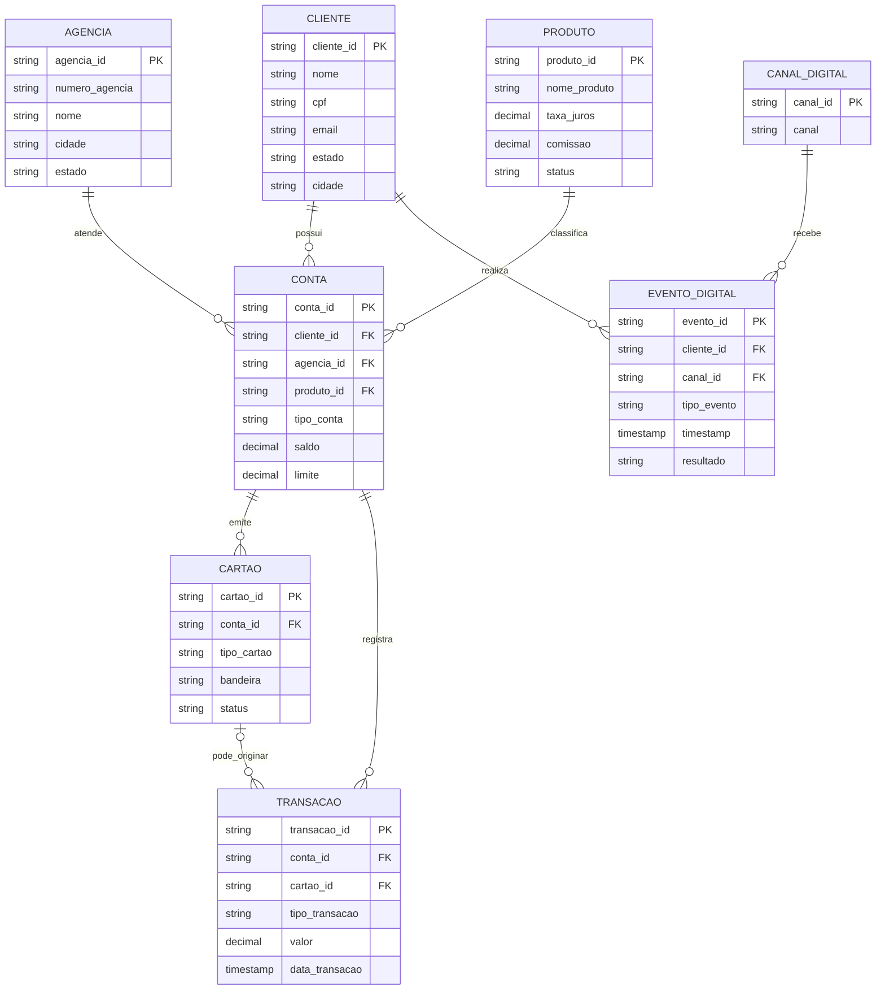
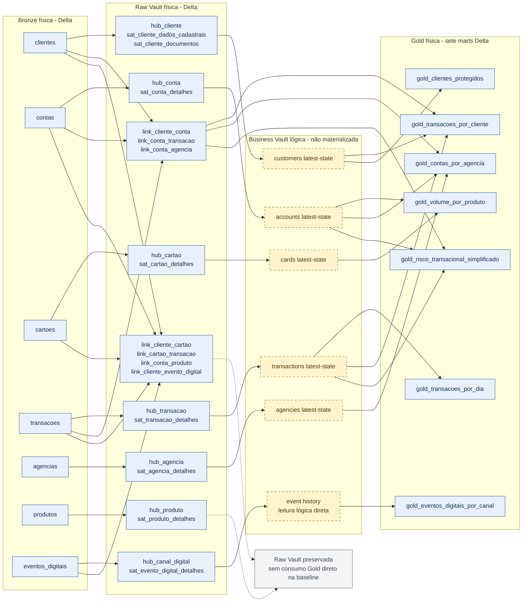

# Domínio bancário sintético e linhagem até a Gold

Este documento é a visão visual canônica do modelo implementado. Ele deve ser
lido na ordem **domínio sintético → Data Vault → consumo Gold**. Os nomes físicos
foram conferidos em
[`PipelineConfig`](../../jobs/common/config.py), nos loaders da
[`Raw Vault`](../../jobs/raw_vault/) e nos builders da
[`Gold`](../../jobs/business_vault/load_gold.py).

O escopo é demonstrativo e usa somente dados sintéticos. O desenho não afirma
modelo produtivo, catálogo corporativo, streaming produtivo, SLA ou conformidade
formal com a LGPD.

## 1. Domínio bancário sintético

O primeiro diagrama descreve o domínio antes da decomposição em Data Vault. As
cardinalidades representam as chaves presentes nas fontes sintéticas. Uma
transação sempre referencia uma conta e pode ou não referenciar um cartão.

`EVENTO_DIGITAL` existe como registro de origem. A implementação atual cria o
Hub de `CANAL_DIGITAL`; não cria um Hub separado para `evento_id`.

## 2. Bronze → Raw Vault → Business Vault lógica → Gold

Azul identifica estruturas Delta físicas. Amarelo tracejado identifica
composições lógicas calculadas durante a construção da Gold: a baseline atual
**não materializa tabelas de Business Vault**. Cinza identifica uma observação,
não uma camada de dados.

Os nós de Links agrupam as relações físicas por uso para manter o diagrama
legível. Somente `link_cliente_conta`, `link_conta_transacao` e
`link_conta_agencia` participam diretamente dos builders Gold atuais. Os demais
Links e a estrutura de produto continuam persistidos na Raw Vault, mas não
devem ser interpretados como dependência de um mart sem que o código passe a
consumi-los.

### Mapa físico da Raw Vault

| Fonte Bronze | Hub físico | Satellite físico | Relações físicas derivadas |
|---|---|---|---|
| `clientes` | `hub_cliente` | `sat_cliente_dados_cadastrais`, `sat_cliente_documentos` | participa de `link_cliente_conta`, `link_cliente_cartao` e `link_cliente_evento_digital` |
| `contas` | `hub_conta` | `sat_conta_detalhes` | `link_cliente_conta`, `link_conta_agencia`, `link_conta_produto`; também auxilia `link_cliente_cartao` |
| `cartoes` | `hub_cartao` | `sat_cartao_detalhes` | `link_cliente_cartao`, `link_cartao_transacao` |
| `transacoes` | `hub_transacao` | `sat_transacao_detalhes` | `link_conta_transacao`, `link_cartao_transacao` |
| `agencias` | `hub_agencia` | `sat_agencia_detalhes` | referenciada por `link_conta_agencia` |
| `produtos` | `hub_produto` | `sat_produto_detalhes` | referenciada por `link_conta_produto` |
| `eventos_digitais` | `hub_canal_digital` | `sat_evento_digital_detalhes` | participa de `link_cliente_evento_digital` |

### Dependências dos sete marts Gold

| Mart físico | Composição lógica e dependências Raw Vault implementadas |
|---|---|
| `gold_transacoes_por_dia` | `transactions latest-state` |
| `gold_transacoes_por_cliente` | `transactions latest-state` + `customers latest-state` + `link_conta_transacao` + `link_cliente_conta` |
| `gold_clientes_protegidos` | `customers latest-state`; aplica pseudonimização e masking demonstrativos |
| `gold_volume_por_produto` | `accounts latest-state` + `cards latest-state`; na baseline, agrupa `tipo_conta` e `tipo_cartao`, não consome `hub_produto` |
| `gold_eventos_digitais_por_canal` | histórico físico de `sat_evento_digital_detalhes`, lido logicamente sem seleção latest-state |
| `gold_contas_por_agencia` | `accounts latest-state` + `agencies latest-state` + `link_conta_agencia` |
| `gold_risco_transacional_simplificado` | `transactions latest-state` + `accounts latest-state` + `link_conta_transacao`; regra ilustrativa, não decisão de crédito |

### Contrato entre camadas

| Camada | Estado nesta baseline | Persistência |
|---|---|---|
| Bronze | cópia validada das sete fontes sintéticas, com metadados técnicos | física, Delta |
| Raw Vault | sete Hubs, sete Links e oito Satellites | física, Delta |
| Business Vault | helpers latest-state e leitura lógica usados pelos builders | lógica, não materializada |
| Gold | sete marts reconstruídos pelos builders | física, Delta |

Ao alterar uma tabela no [`PipelineConfig`](../../jobs/common/config.py), um
loader Raw Vault ou um builder Gold, atualize este documento e execute o teste
de contrato visual. O teste rejeita nomes físicos ausentes ou extras no
diagrama, reduzindo o risco de deriva entre código e documentação.
